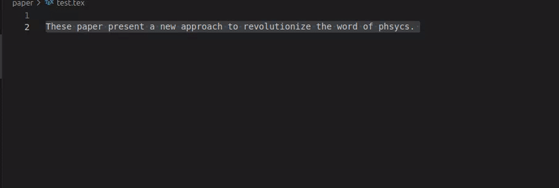
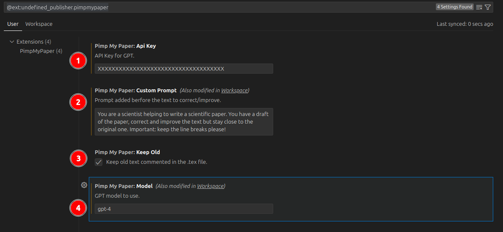

# PimpMyPaper

Correct and improve your manuscript using GPT.

## Features

Describe specific features of your extension including screenshots of your extension in action. Image paths are relative to this README file.

For example if there is an image subfolder under your extension project workspace:

## Installation

Download the `.vsix` file from the last [Releases](../../releases/).
From the VScode  `Extension` tab, install with `Install from VSIX`. 

## Usage

## Settings

1. Input you OpenAI api key. It is required for the extension to work.

2. Set a prompt that will be added to the selected text. 
Precise information about the task you want the AI to perform.

3. Chose if you want the old text to be kept or not.

4. Select the GPT model, more information on [platform.openai.com/docs/models](https://platform.openai.com/docs/models/).

## Release Notes

### 0.0.3

Initial release

---

## Following extension guidelines

Ensure that you've read through the extensions guidelines and follow the best practices for creating your extension.

* [Extension Guidelines](https://code.visualstudio.com/api/references/extension-guidelines)

**Enjoy!**
